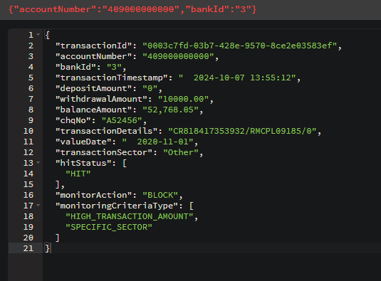

# Getting Started

Based on dataset from kaggle: https://www.kaggle.com/datasets/demodatauk/full-banking-transaction-log-sample

### Guide
This is a kafka streams application and in such requires a kafka broker to be running on your machine before starting. 
You can overwrite the broker properties in application.properties file in resources folder. 
These are things like the input and output topics to be used. 

--- 

Currently we have two criteria that are we are checking against every transaction.
1. If a transaction exceeds a limit of $10,000 whether withdrawal or deposit.
2. If a transaction is of "Other" specific category. 

These can be extended to include more criteria. For example, 
to check every transaction does not exceed $10,000, we need the following classes:
- add HIGH_TRANSACTION_AMOUNT to `MonitoringCriteriaType` enum
- add a Criteria class that extends `MonitoringCriteriaItem`
  - override the required methods to provide the logic for the criteria
- add criteriaValue class that extends `MonitoringCriteriaValue`
  - override the required methods to provide the logic for the criteria value
- add a case statement for the new criteria in `MonitoringCriteriaFactory`
- add the MonitoringCriteriaTye to list of required criteria in `FraudDetectionTransformer`

### Running the application
Once you start the application you should see transactions loaded to the 
topic 'transaction.input' . If a transaction meets any of the listed criteria,
then it will marked with a HitStatus and a monitoring action that specifies what
to do with the transaction ie BLOCK, REVIEW, ALLOW.

In our case we can see 3 of the 10 transactions have been marked as fraudulent 
and queued to topic 'transaction.fraud.result'.

